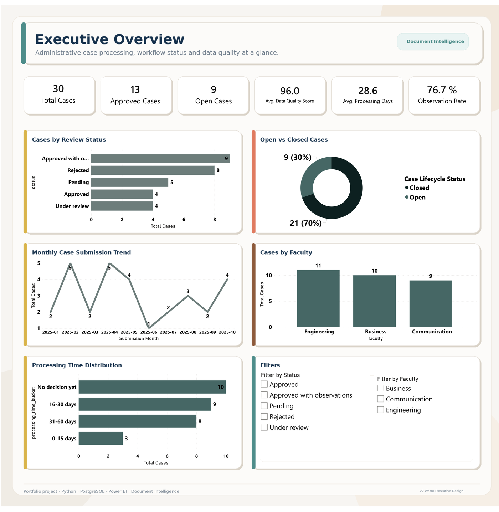
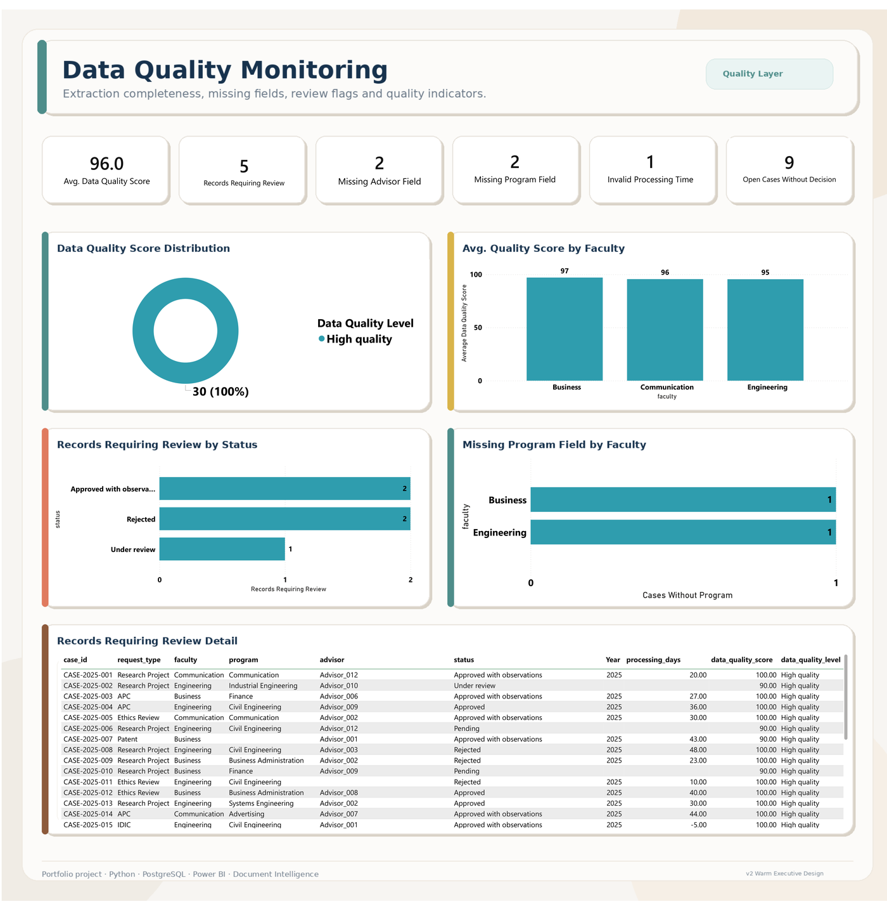
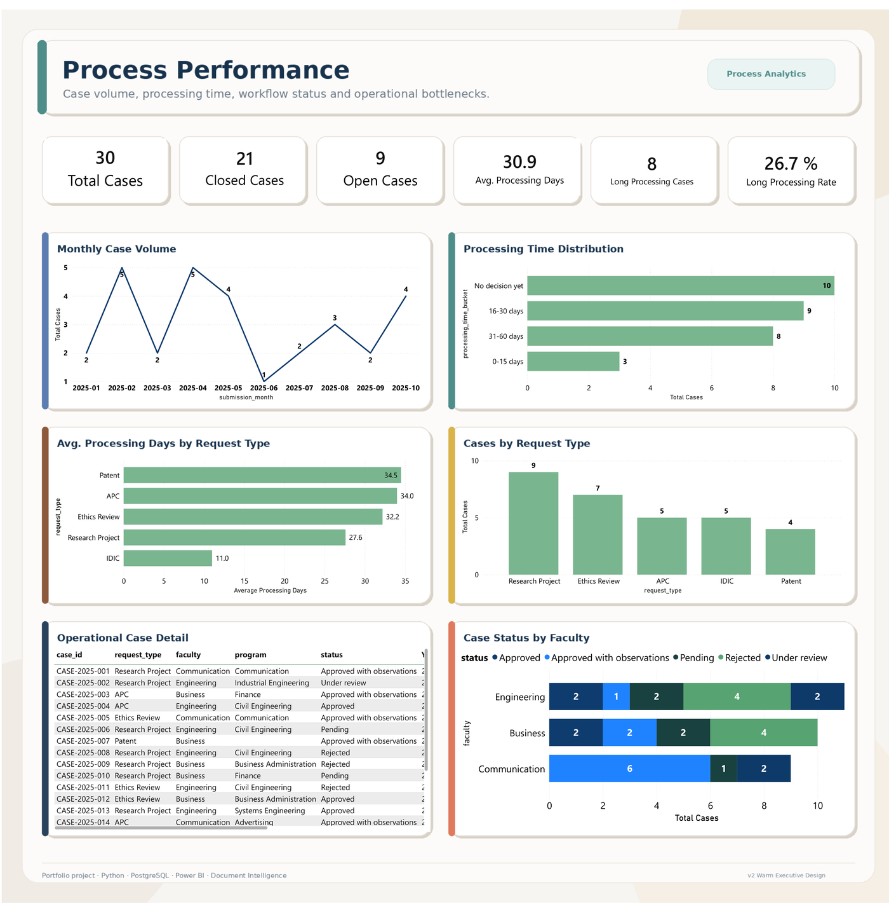
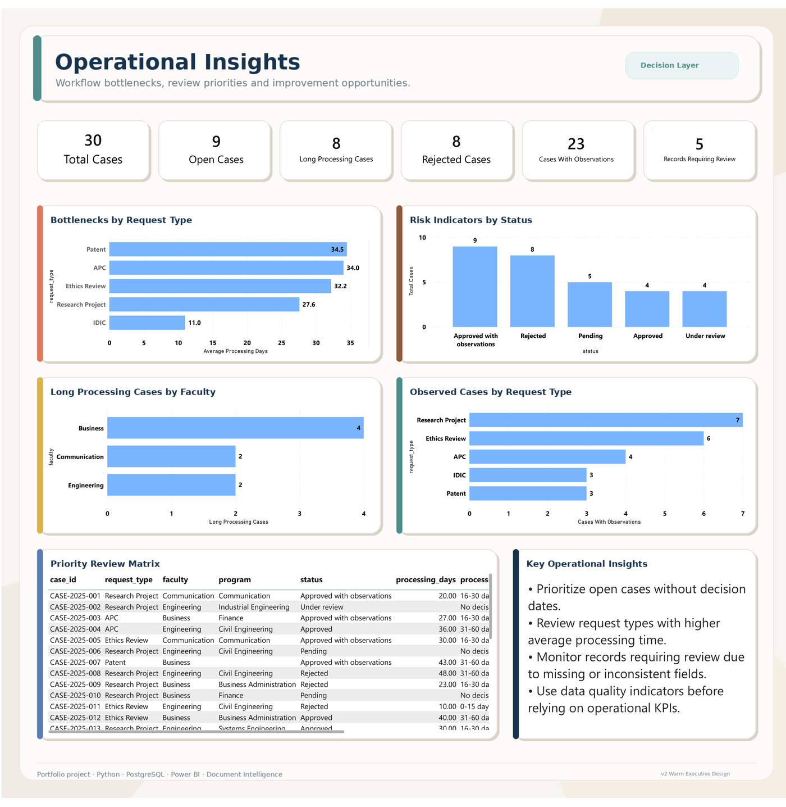

# Document Intelligence & Analytics Platform for Administrative Workflows

An end-to-end analytics engineering project that transforms semi-structured administrative documents into validated, modeled, and decision-ready data for operational reporting.

This project simulates a real-world administrative workflow where case information is stored across PDF, Word, and text documents. The platform extracts key fields, validates data quality, loads the results into PostgreSQL, builds an analytics-ready model, and connects the final view to a Power BI dashboard.

---

## Project Overview

Administrative teams often manage case-based workflows through semi-structured documents such as application forms, review memos, committee reports, and decision letters. These documents usually contain valuable operational information, but the data is difficult to analyze because it is not stored in a structured database.

This project solves that problem by creating a reproducible data pipeline that converts document-based case information into structured analytical data.

The solution covers the full workflow:

```text
PDF / Word / TXT documents
        ↓
Python extraction layer
        ↓
Data quality validation
        ↓
Processed CSV output
        ↓
PostgreSQL staging tables
        ↓
Analytics dimensional model
        ↓
Power BI-ready SQL view
        ↓
Power BI dashboard
```

The public version uses synthetic documents to preserve privacy while keeping the structure and analytical complexity of a real administrative workflow.

---

## Business Problem

Administrative review processes depend on timely, complete, and reliable case information. When the data is stored manually across documents and spreadsheets, several problems appear:

- case tracking becomes slow and inconsistent;
- missing fields are difficult to detect;
- processing delays are not easy to monitor;
- reporting depends on manual spreadsheet updates;
- operational bottlenecks remain hidden;
- decision-makers lack a consolidated view of workflow performance.

The goal of this project is to automate the extraction and transformation of administrative case data so that it can be monitored through reliable KPIs and dashboards.

---

## Solution

The platform extracts structured information from semi-structured documents and converts it into a clean analytical model.

The current version includes:

- synthetic administrative documents in `.txt`, `.docx`, and `.pdf` formats;
- Python-based document extraction;
- field parsing and date normalization;
- data quality scoring;
- missing-field detection;
- PostgreSQL database running in Docker;
- staging and analytics schemas;
- dimensional model with fact and dimension tables;
- Power BI-ready SQL view;
- Power BI dashboard with four analytical pages;
- reusable warm executive dashboard design system.

---

## Tech Stack

| Layer | Technology |
|---|---|
| Document processing | Python, PyMuPDF, python-docx |
| Data manipulation | Pandas |
| Database | PostgreSQL |
| Local infrastructure | Docker, Docker Compose |
| Data modeling | SQL, dimensional modeling |
| Data quality | Python validation rules, SQL checks |
| Dashboarding | Power BI Desktop |
| Version control | Git, GitHub |
| Design system | Power BI JSON theme, custom 2000 × 2000 backgrounds |

---

## Repository Structure

```text
document-intelligence-analytics-platform/
│
├── README.md
├── requirements.txt
├── .gitignore
├── .env.example
├── docker-compose.yml
│
├── data/
│   ├── raw/
│   ├── sample/
│   └── processed/
│
├── docs/
│   ├── architecture.md
│   ├── business_problem.md
│   ├── data_dictionary.md
│   └── project_roadmap.md
│
├── scripts/
│   └── generate_sample_documents.py
│
├── src/
│   ├── extract/
│   ├── load/
│   ├── quality/
│   └── utils/
│
├── sql/
│   ├── create_tables.sql
│   ├── build_analytics_model.sql
│   ├── create_powerbi_view.sql
│   └── analytical_queries.sql
│
├── tests/
│   └── test_parser.py
│
├── powerbi/
│   ├── document_intelligence_dashboard.pbix
│   ├── screenshots/
│   │   ├── executive_overview.png
│   │   ├── data_quality_monitoring.png
│   │   ├── process_performance.png
│   │   └── operational_insights.png
│   └── design/
│
└── notebooks/
```

---

## Data Pipeline

### 1. Synthetic Document Generation

The project includes a script that generates synthetic administrative case documents. These documents preserve the structure of real administrative workflows while avoiding the use of sensitive or institutional data.

The generated documents include variations such as:

- approved cases;
- rejected cases;
- pending cases;
- cases under review;
- cases with missing program fields;
- cases with missing advisor fields;
- cases with invalid processing dates;
- cases with observations.

### 2. Document Extraction

The extraction layer reads documents from the sample folder and extracts key-value fields such as:

- case ID;
- document type;
- request type;
- title;
- applicant;
- coauthors;
- advisor;
- faculty;
- program;
- submission date;
- review date;
- decision date;
- status;
- result;
- observations.

The parser works line by line to avoid common extraction errors, such as capturing the next field when a value is missing.

### 3. Data Quality Validation

The pipeline calculates a data quality score for each record and identifies issues related to completeness and consistency.

Current validation rules include:

- required field completeness;
- missing program detection;
- missing advisor detection;
- invalid processing time detection;
- open cases without decision dates;
- parsing issues caused by empty fields;
- suspicious values in categorical fields.

### 4. PostgreSQL Load

Processed records are loaded into PostgreSQL using a staging schema.

Main staging table:

```text
staging.stg_cases
```

The database runs locally through Docker using port `5433`.

### 5. Analytics Model

The analytics layer converts staging data into a reporting model.

Main analytics objects:

```text
analytics.dim_faculty
analytics.dim_program
analytics.dim_status
analytics.fact_cases
analytics.vw_cases_powerbi
```

The Power BI view includes additional reporting fields such as:

- submission month;
- month sort key;
- processing time bucket;
- processing time bucket order;
- data quality level;
- data quality level order;
- case lifecycle status;
- status order.

---

## Data Model

The current analytics model follows a simple star-schema structure.

```text
analytics.dim_faculty
        ↓
analytics.fact_cases
        ↑
analytics.dim_program
        ↑
analytics.dim_status
```

### Fact Table

`analytics.fact_cases` stores one row per administrative case.

Main measures and attributes include:

- case ID;
- request type;
- applicant;
- advisor;
- faculty key;
- program key;
- status key;
- submission date;
- review date;
- decision date;
- processing days;
- data quality score;
- observation flag;
- open case flag.

### Dimensions

| Dimension | Purpose |
|---|---|
| `dim_faculty` | Groups cases by faculty |
| `dim_program` | Groups cases by academic or administrative program |
| `dim_status` | Standardizes review status categories |

### Power BI View

`analytics.vw_cases_powerbi` joins fact and dimension tables into a reporting-ready view. This keeps Power BI simpler and ensures that business logic stays closer to the database layer.

---

## Dashboard Preview

The Power BI dashboard includes four pages:

1. **Executive Overview**  
   High-level KPIs for case volume, approval status, open cases, processing time, observations, and data quality.

2. **Data Quality Monitoring**  
   Monitoring page for extraction completeness, missing fields, records requiring review, and data quality indicators.

3. **Process Performance**  
   Operational performance page focused on case volume, processing time, request types, and workflow status by faculty.

4. **Operational Insights**  
   Decision-oriented page highlighting bottlenecks, long-processing cases, observed cases, rejected cases, and review priorities.

### Executive Overview



### Data Quality Monitoring



### Process Performance



### Operational Insights



---

## Key Dashboard Metrics

The dashboard tracks the following indicators:

| Metric | Description |
|---|---|
| Total Cases | Number of processed administrative cases |
| Approved Cases | Cases approved with or without observations |
| Open Cases | Cases still pending or under review |
| Closed Cases | Cases with a final review outcome |
| Average Processing Days | Average time between submission and decision |
| Long Processing Cases | Cases taking more than 30 days |
| Observation Rate | Share of cases with observations |
| Data Quality Score | Average completeness score across extracted records |
| Records Requiring Review | Records flagged by quality rules |
| Missing Program Field | Records without a program value |
| Missing Advisor Field | Records without an advisor value |
| Invalid Processing Time | Records with negative processing duration |
| Open Cases Without Decision | Open cases without decision dates |

---

## How to Run Locally

### 1. Clone the repository

```bash
git clone https://github.com/<your-username>/document-intelligence-analytics-platform.git
cd document-intelligence-analytics-platform
```

### 2. Create a virtual environment

```bash
python -m venv .venv
```

On Windows PowerShell:

```powershell
.venv\Scripts\activate
```

### 3. Install dependencies

```bash
pip install -r requirements.txt
```

### 4. Generate synthetic documents

```bash
python scripts/generate_sample_documents.py
```

### 5. Run the extraction pipeline

```bash
python -m src.main
```

Expected output:

```text
Processed documents: 30
Clean output: data/processed/cases_extracted.csv
Quality issues output: data/processed/data_quality_issues.csv
```

### 6. Start PostgreSQL with Docker

```bash
docker compose up -d
```

The PostgreSQL container is exposed locally through port `5433`.

Connection details:

```text
Host: 127.0.0.1
Port: 5433
Database: doc_intelligence
User: postgres
Password: postgres
```

### 7. Create database tables

```powershell
Get-Content .\sql\create_tables.sql | docker exec -i doc_intelligence_postgres psql -U postgres -d doc_intelligence
```

### 8. Load processed data into PostgreSQL

Create the local environment file:

```powershell
copy .env.example .env
```

Then load the data:

```bash
python -m src.load.load_to_postgres
```

Expected output:

```text
Loaded 30 records into staging.stg_cases
```

### 9. Build the analytics model

```powershell
Get-Content .\sql\build_analytics_model.sql | docker exec -i doc_intelligence_postgres psql -U postgres -d doc_intelligence
```

### 10. Create the Power BI reporting view

```powershell
Get-Content .\sql\create_powerbi_view.sql | docker exec -i doc_intelligence_postgres psql -U postgres -d doc_intelligence
```

### 11. Validate the reporting view

```powershell
docker exec -it doc_intelligence_postgres psql -U postgres -d doc_intelligence -c "SELECT COUNT(*) FROM analytics.vw_cases_powerbi;"
```

Expected result:

```text
count
-----
30
```

---

## Power BI Connection

To connect Power BI Desktop to PostgreSQL:

```text
Get data → PostgreSQL database
```

Use:

```text
Server: 127.0.0.1:5433
Database: doc_intelligence
Data Connectivity mode: Import
```

Credentials:

```text
Username: postgres
Password: postgres
```

Select the view:

```text
analytics.vw_cases_powerbi
```

The dashboard file is located in:

```text
powerbi/document_intelligence_dashboard.pbix
```

---

## Testing

Run tests with:

```bash
pytest
```

The test suite validates the document parser and includes a specific case for empty fields to ensure the parser does not incorrectly capture the following line as a value.

---

## Data Privacy

This repository does not publish real administrative records, institutional documents, personal data, internal codes, signatures, or confidential observations.

The public version uses synthetic documents that preserve the structure and complexity of real administrative workflows without exposing sensitive information.

This approach allows the project to demonstrate realistic document intelligence and analytics engineering capabilities while respecting privacy and confidentiality.

---

## Current Status

Completed:

- [x] Initial project structure
- [x] Synthetic document generation
- [x] Python extraction pipeline
- [x] PDF, Word, and TXT document reading
- [x] Data quality validation
- [x] Processed CSV output
- [x] PostgreSQL Docker setup
- [x] Staging table load
- [x] Analytics dimensional model
- [x] Power BI reporting view
- [x] Power BI dashboard with four pages
- [x] Dashboard screenshots for README
- [x] Warm executive Power BI design system

In progress / planned:

- [ ] Add dbt transformations
- [ ] Add Airflow orchestration
- [ ] Add Azure Blob Storage integration
- [ ] Add Azure Document Intelligence version
- [ ] Add GitHub Actions validation workflow
- [ ] Add automated data quality report
- [ ] Add deployment notes for cloud environments

---

## Future Improvements

Planned improvements include:

- replacing SQL scripts with dbt models;
- adding Airflow orchestration for scheduled runs;
- creating a cloud version using Azure Blob Storage and Azure SQL or PostgreSQL;
- integrating Azure Document Intelligence for advanced document extraction;
- adding CI checks with GitHub Actions;
- improving data quality logging and audit trails;
- adding incremental loads;
- adding a production-style monitoring layer;
- creating a Power BI Service deployment version.

---

## Portfolio Value

This project demonstrates the ability to work across the full analytics pipeline:

- document processing;
- Python automation;
- data extraction;
- data quality validation;
- PostgreSQL modeling;
- SQL transformations;
- dimensional modeling;
- Power BI reporting;
- dashboard design;
- operational analytics;
- privacy-aware portfolio development.

It is designed to support a transition from data analysis into analytics engineering and junior data engineering roles.

---

## CV Summary

Built an end-to-end document intelligence and analytics platform using Python, PostgreSQL, SQL, data quality checks, Docker and Power BI to extract, validate, model and visualize administrative case data from semi-structured PDF, Word and text documents.

---

## License

This project is intended for educational and portfolio purposes. The dataset is synthetic and does not represent real individuals, institutions, or confidential administrative records.
